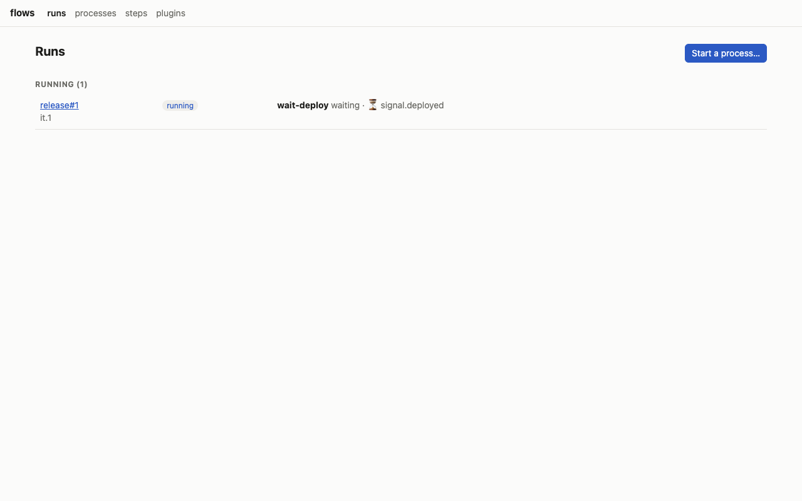
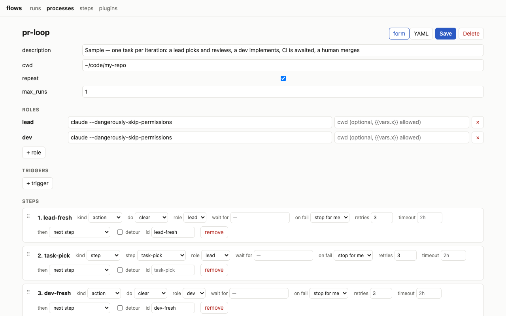

# flows

Local agent processes built from reusable steps, run across agterm sessions, with a CLI and a
web UI.



## Why

Long agent work is a loop: pick a task, implement it in a fresh context, review it, open a PR,
wait for CI, fix it, merge, start over. Doing that by hand means typing the next prompt into the
right terminal at the right moment, clearing contexts, and noticing when CI finished. flows
writes the loop down once as a process and runs it: it moves work between agent sessions, and
outside events (CI, a merge, a message) wake it up. It runs on your machine, in terminals you can
watch and take over at any time.

## What you get

- **Steps** as Markdown prompts with `{{placeholders}}`, reused across processes.
- **Processes** as YAML: roles, order, retries, `goto` on failure, detours, waits for events,
  repeating iterations, cron and event triggers.
- **flowd**, a local daemon that types each step into the right [agterm](https://github.com/umputun/agterm)
  session (spawning it when needed), clears or compacts between steps, never interrupts a turn,
  and reminds an agent that went quiet without reporting.
- **A web UI** to watch runs, close human steps, override (done, skip, retry, goto), edit
  processes and steps, and jump to an agent's terminal in one click.
- **Plugins** for event sources and actions, as waits or as triggers that start a process. `gh`
  is built in: required checks, reviews, and per repo merged PRs, newly opened or labelled PRs
  and CI runs on a branch.

## Requirements

- macOS
- [agterm](https://github.com/umputun/agterm) with `agtermctl` on `PATH`
- Node.js 24 or newer
- [Claude Code](https://claude.com/claude-code)
- [GitHub CLI](https://cli.github.com) (`gh`), for the `gh` plugin

## Install

```bash
git clone <this repo> flows && cd flows
npm install
bin/flow install
mkdir -p ~/.config/flows && cp -Rn examples/* ~/.config/flows/
```

`flow install` changes these, and can be re-run at any time (it replaces its own entries):

- a launchd agent `local.flows` that keeps flowd running (log: `~/.local/state/flows/flowd.log`);
- two hook lines in `~/.config/agterm/hooks.conf`, so flowd knows when an agent's turn ends;
- a `PostCompact` hook in `~/.claude/settings.json` (a backup is written to `settings.json.bak-flows`);
- the skills `flow` and `flow-author` in `~/.claude/skills/`;
- `~/.local/bin/flow`.

`flow` is now at `~/.local/bin/flow`; make sure `~/.local/bin` is on your `PATH`, or call
`bin/flow` from the checkout. Then open http://127.0.0.1:7420.

## Quickstart: the demo

The `demo` process has an agent step, a compact, a clear, a wait for a signal and a human step.
It runs in `/tmp`.

```bash
flow start demo
```

1. A workspace `demo` appears in agterm with a session `demo#1 agent`. Claude starts with the line
   `▶ flow: step demo-hello …`, runs `flow show`, says hello, runs `flow set greeting=hello` and
   `flow done`.
2. flowd types `/compact`, and the run moves on when compaction ends. Then it types `/clear`.
3. The run waits: `flow ls` shows `waits signal.demo`. Wake it:

   ```bash
   flow signal demo msg=hi
   ```

   The agent gets a new line, reads `msg=hi` in `flow show` and reports done.
4. The last step is yours. The Runs page lists `demo#1` under "Needs you"; open it and press
   **done**. `flow ls --all` shows the run `done`.

The `agent ↗` button on the Runs page selects that agent's session in agterm.

## A process at a glance

```yaml
description: "Sample — one task per iteration: a lead picks and reviews, a dev implements, CI is awaited, a human merges"
cwd: ~/code/my-repo
repeat: true
max_runs: 1
roles:
  lead: {spawn: "claude --dangerously-skip-permissions"}
  dev:  {spawn: "claude --dangerously-skip-permissions"}
steps:
  - {id: lead-fresh, do: clear, role: lead}
  - {step: task-pick, role: lead}
  - {id: dev-fresh, do: clear, role: dev}
  - {step: task-implement, role: dev}
  - {step: task-review, role: lead, on_fail: {goto: task-implement}}
  - {step: task-pr, role: lead}
  - {id: ci, wait_for: gh.checks, on_fail: {goto: ci-fix}}
  - {step: task-merge, role: human, wait_for: gh.merged}
  - {step: ci-fix, role: dev, detour: true, after: {goto: ci}}
```

Entries run top to bottom; each `step` names a prompt file in `steps/` and the role whose session
gets it. A failed review goes back to `task-implement`, red CI takes the `ci-fix` detour and
returns to the wait, and the merge is a human step that GitHub's merge event closes. With
`repeat: true` the next task starts when this one is merged.



## Agents

An agent sees one line per step:

```
▶ flow: step task-review · pr-loop#3 it.2 — run `flow show` for the instructions
```

and works with a few commands: `flow show` (the instructions), `flow done --note "…"`,
`flow failed --note "…"`, `flow set key=value`, and `flow wait --note "…"` when it ends its turn
on purpose to wait for something. The `flow` skill teaches an agent exactly
that. The `flow-author` skill teaches an agent to write and change steps, processes, triggers and
plugins, and to check them with `flow check`.

## Documentation

| Doc | What is in it |
|---|---|
| [docs/concepts.md](docs/concepts.md) | Steps, processes, roles, runs, events, delivery, reminders, triggers. |
| [docs/processes.md](docs/processes.md) | Every key of a step file and a process, validation messages, recipes. |
| [docs/plugins.md](docs/plugins.md) | Writing a plugin; the `gh` plugin as a worked example. |
| [docs/cli.md](docs/cli.md) | Every `flow` command and environment variable. |
| [docs/http-api.md](docs/http-api.md) | Every HTTP endpoint. |
| [docs/architecture.md](docs/architecture.md) | Modules, an event's path, storage, restart recovery, security model. |
| [docs/troubleshooting.md](docs/troubleshooting.md) | Symptom, check, fix. |

## Status

Alpha. The demo was verified end to end on a live
agterm on 2026-10-04. Known gaps are listed one per file in [docs/backlog/](docs/backlog/).

## Contributing

See [CONTRIBUTING.md](CONTRIBUTING.md). Agents working in this repo follow [CLAUDE.md](CLAUDE.md).

## License

[MIT](LICENSE)
